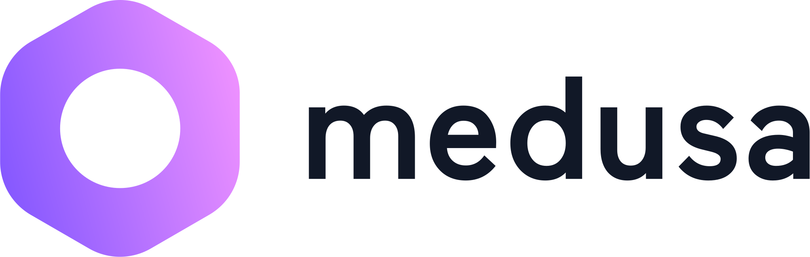
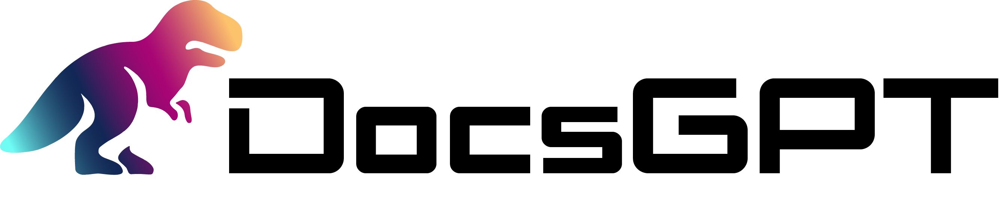

# Neon Open Source Program

**What is Neon?**

Neon is a serverless, autoscaling Postgres platform built for modern applications. It separates storage and compute to deliver fast provisioning, branching, and a pay-for-what-you-use experience.

**What is the Neon Open Source Program** 

The [Neon Open Source Program](https://https://neon.com/programs/open-source) is for anyone building open source tools that use Postgres. Selected projects receive up to $5,000 yearly in platform credits, enrollment in a cash referral program, and marketing support to expand visibility. This org is where we manage payouts for this program. 

If you’re building open-source tools powered by Postgres, we want to help you grow:

- ✅ **Up to $5,000 in Neon credits each year**
- 💸 **Real cash payouts through GitHub Sponsorships**
- 📣 **Promotional support** to help your work reach millions of developers

# Sponsored Projects

  
  

**Apply to the program**

If you would like to be sponsored by Neon, you can apply [here](https://neon.com/programs/open-source).
